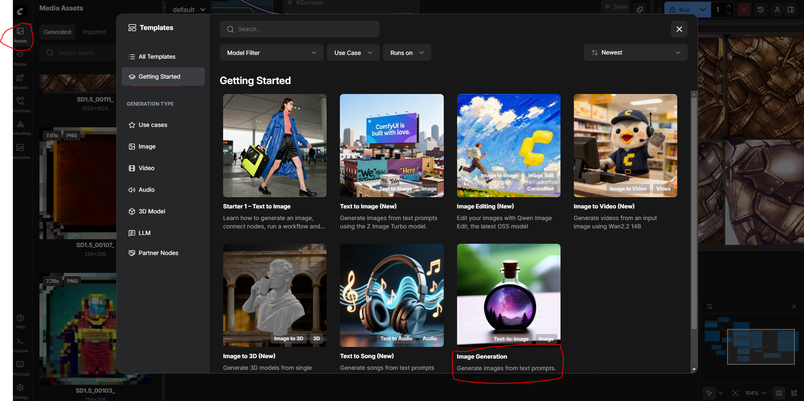
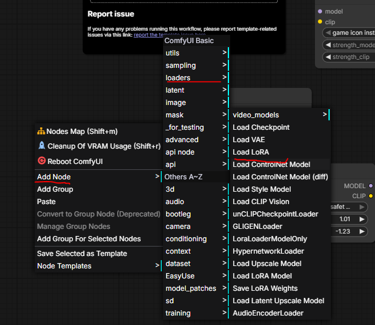
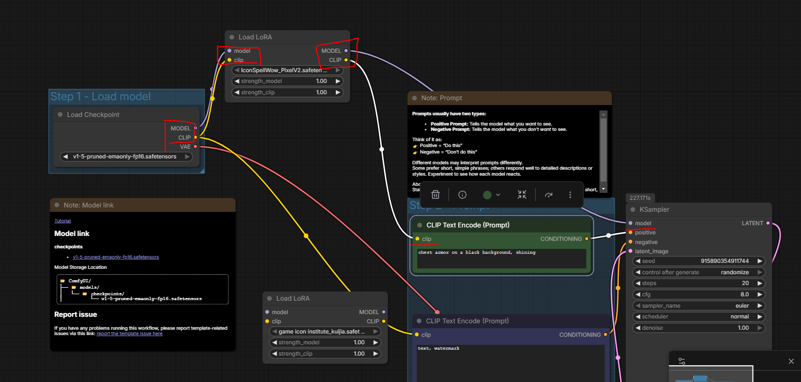
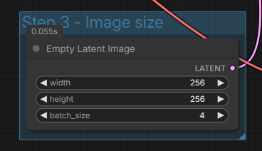

# Prequisite LoRa models

- Go to civitai.com, search for something like 'game icon' and download a lora model. 

- **MUST**: Read up on the lora's pages. Sometimes they require you to use Trigger words in your text prompts, or they have videos to show you how to use them, or their own model. Try for an SD1.5 model.

- Copy those loras (usually .safetensor files) into your Documents/ComfyUI/models/loras/ folder.

Reference loras:

- https://civitai.com/models/104265/wow-spell-icon-concept-lora

# ComfyUI

- Click **Templates** on the LHS bar.

- Click **Getting Started**

- Click **Image Generation**

- You should see have a workflow of nodes. Install any required model. You may do a test run.

## Loading Lora node 

- First ensure your models are present. On the LHS bar, click **Models**, click the refresh icon, check if the **loras** folder has your downloaded models.

- Right click on an empty space, "Add Node -> loaders -> Load LoRA " OR drag and drop the LoRA from the folder itself.

- Link the `MODEL` of the `Load Checkpoint` output node to the `model` input of your lora model. See 1:45 of the video. Do the same for the other out/inputs.

- Link the `MODEL` of the `Load LoRA` output node to the `model` input of the Text prompt node. Do the same for the other out/inputs.

- Insert whatever trigger words into your text prompt

- Hit Run (top RHS) to generate the image.

## Tweaking for multiple images

- For when you want the model to produce multiple images at a time.

- Find the `Empty Lantent Image` Node. Change sizes, and `batch_size`.

- Hit Run

