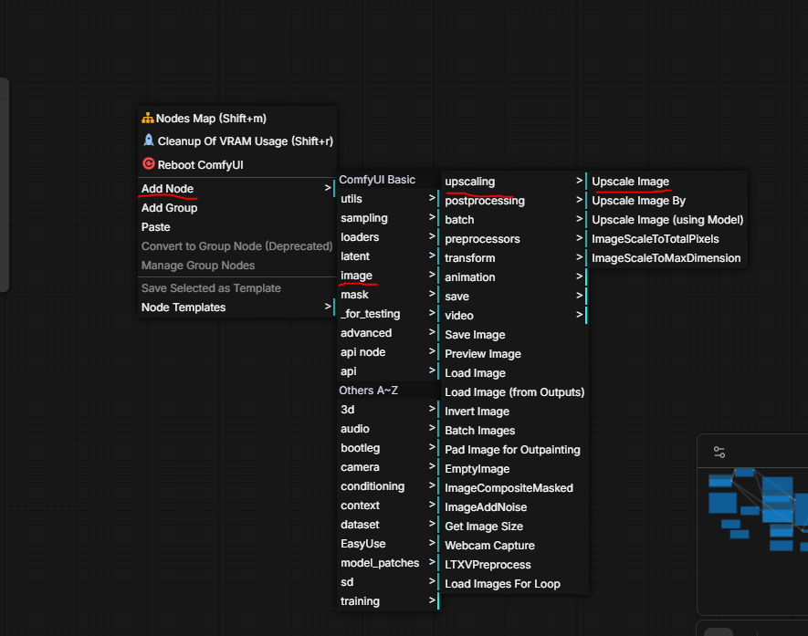
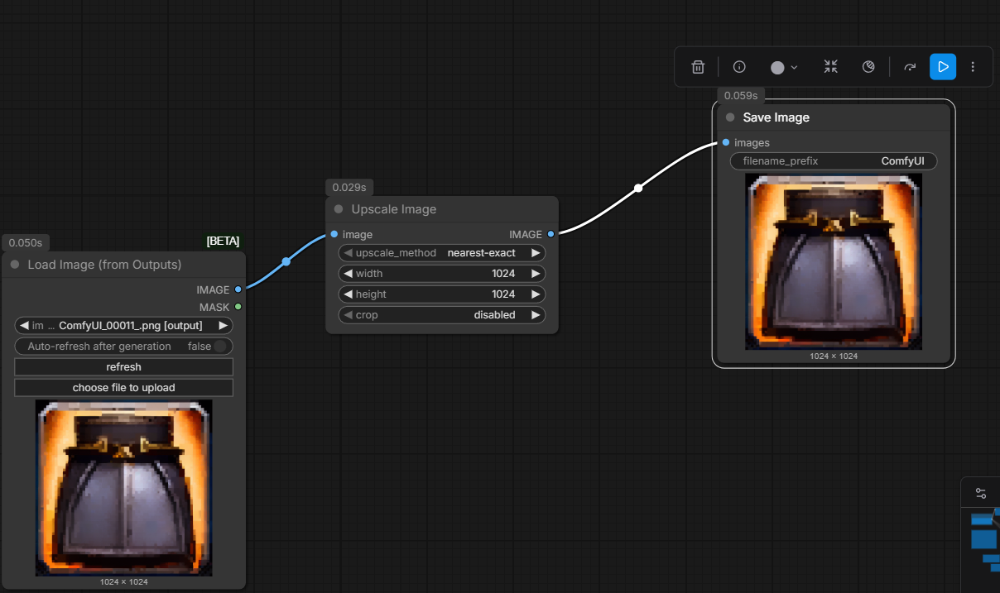

PS. Might be better if you use a plugin associated with AI upscaling

Example: [Gimp AI Upscaler Plugin](https://github.com/Nenotriple/gimp_upscale)

# Adding Image upscaling node & workflow

- Right click on empty space, "Add Node -> image -> upscaling -> Upscale Image"

- You can link existing IMAGE outputs to the newly created node's input

- Alternatively, use "Add Node -> image -> Image (From Outputs)" and create a  "Add Node -> image -> Save Image" node at the end

- Alternatively, there is an option for "Upscale Image (using Model)", but you have to search for your own models