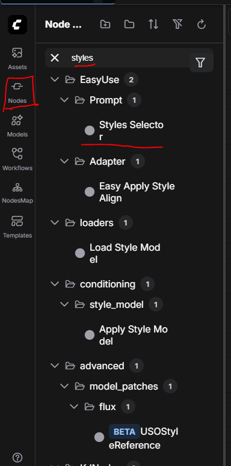
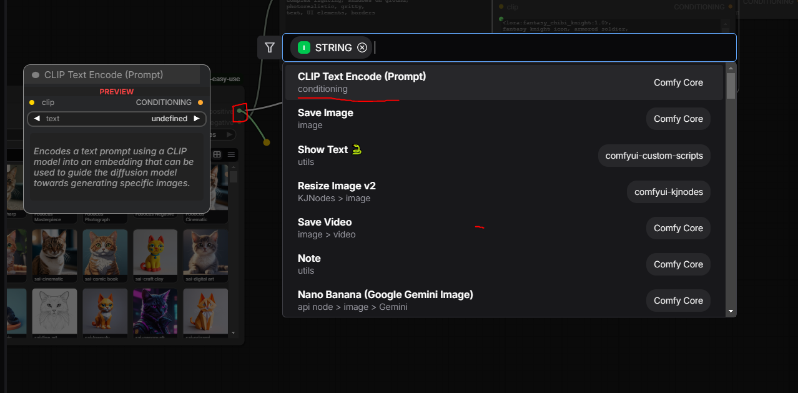
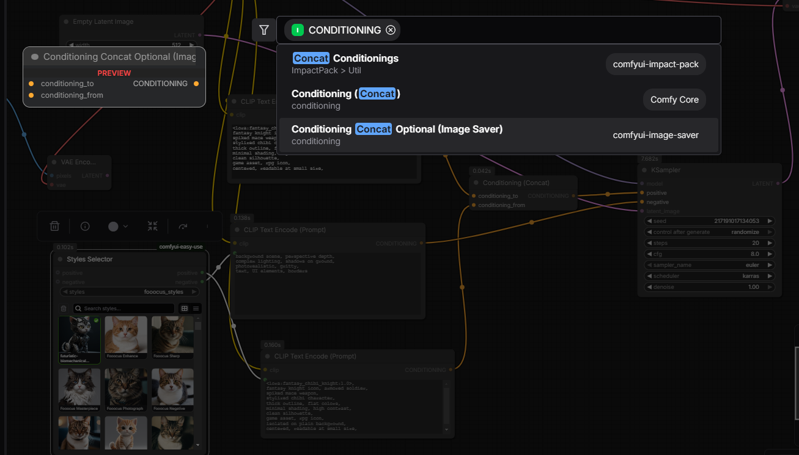
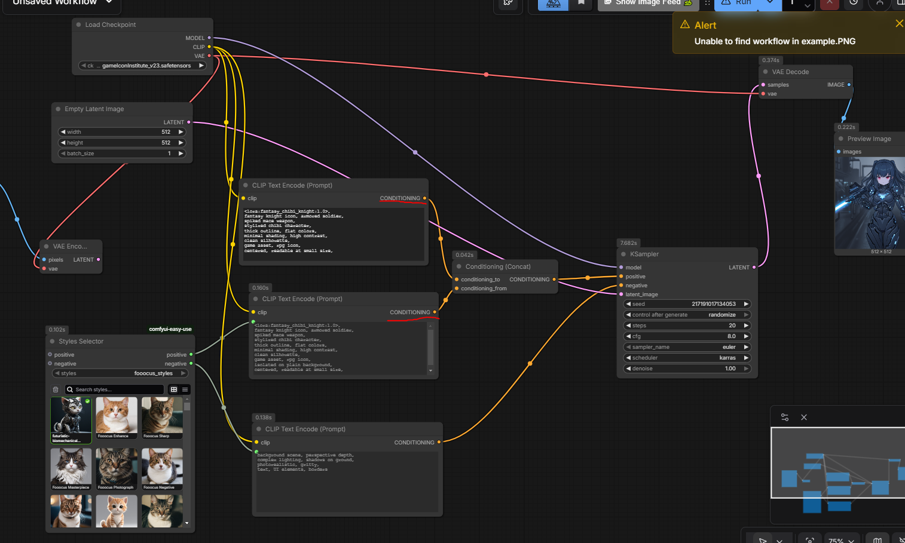

# Prompt modification nodes

- Make use of a style selector node so we can attach styles to what we're prompting for

- Click "Nodes" on the LHS vertical bar, search for "styles", drag in Styles Selector

- Expand the `Styles Selector`'s box. You can search for various styles to use. Click on them to toggle their checkboxes.

- If you mouseover each box, you will note that there are positive and negative prompts. These will be plugged into prompt nodes.

- Drag the pin from the `positive` label of the `Styles Selector` node to an empty space, you will get a menu popup, and select the `CLIP Text Encode (Prompt)`. Repeat the same for the `negative` label of the smae node.

- Drag the pin labelled `CLIP` from your load checkpoint/lora nodes to the newly created `Text Encode (Prompt)` nodes.

- It's time to combine the styles with your custom prompt. Create a `CLIP Text Encode (Prompt)` and a `Conditioning (Concat)` node via dragging the `CONDITIONING` labels and searching for `concat`, then selecting  `Conditioning (Concat)`

- Link the 2 `positive` labels (underlined in red) to the `Conditioning (Concat)` node, and in turn link it to the `KSampler` node. Link the negative prompt to the `negative` label of the `KSampler` node.

- Run the model

## References:

- https://www.youtube.com/watch?v=Xsx-u0OMezw (warning: some outdated things)
