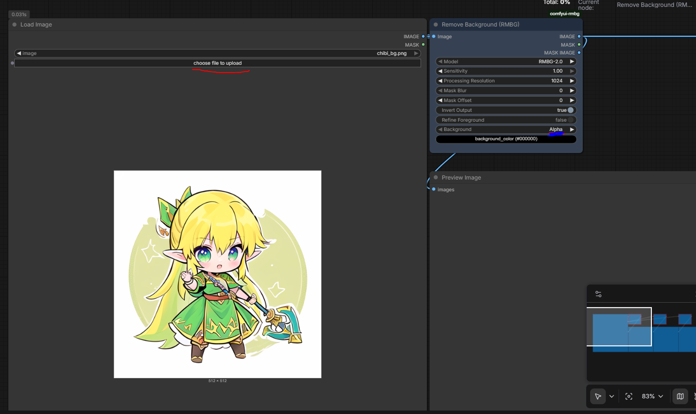

# Background Removal

## Prerequisites

[RMBG-2.0](https://civitai.com/models/949723/rmbg-20-fast-background-remover)

Extract the file, drag and drop it into an empty workspace, install all the stuff comfyui needs you to install, restart if it stalls

## Workflow

- drag and drop it the workflow file into an empty workspace, upload the file with background (marked red in the image), switch Background option of `all 3 nodes` to `Alpha`, switch `Invert Output` option to false, hit run.

## References

- https://comfyui.org/en/remove-backgrounds-with-comfyui

- [Github](https://github.com/1038lab/ComfyUI-RMBG)

- [ComfyUI Tutorial Series Ep 22: Remove Image Backgrounds with ComfyUI or Photoshop](https://www.youtube.com/watch?v=pEcjuclOvKU)

## Alternatives

### Gimp plugin

`Note!` GIMP has an AI background removal tool called rembg that may fulfill this task!  (PS. it's also terrible trying to install it, gotta deal with python BS)

See: [gimp3-rembg-plugin](https://github.com/ismdevteam/gimp3-rembg-plugin) or [Guide](https://www.youtube.com/watch?v=ohI_uO6Xy_Y)

Goto https://gimpchat.com/viewtopic.php?f=9&t=21412 scroll down and download the RemoveBG3.zip `Windows user` link. Extract and put the folder in your gimp plugin folder.

Edit the python file `aiExe = "C:\\Users\\ddeng\\AppData\\Local\\Programs\\Python\\Python310\\Scripts\\rembg.exe"` to something matching your rembg's install

### Old school foreground select techniques

Alternative techniques like foreground select tool, check this [link](https://docs.gimp.org/3.0/en/gimp-tool-foreground-select.html)

Also SASS tools on the internet..