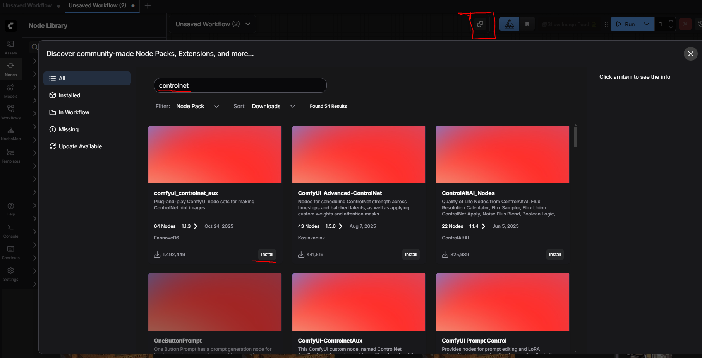
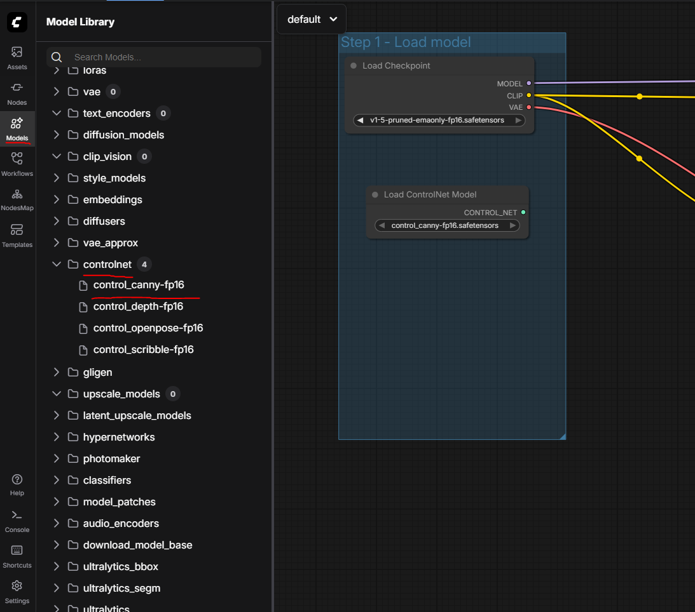
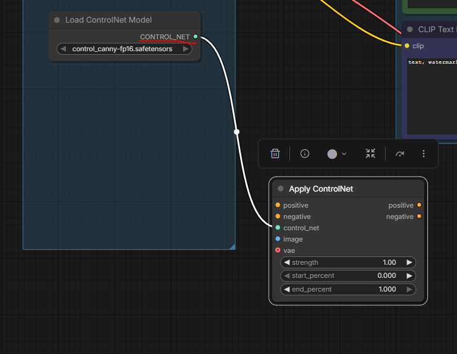
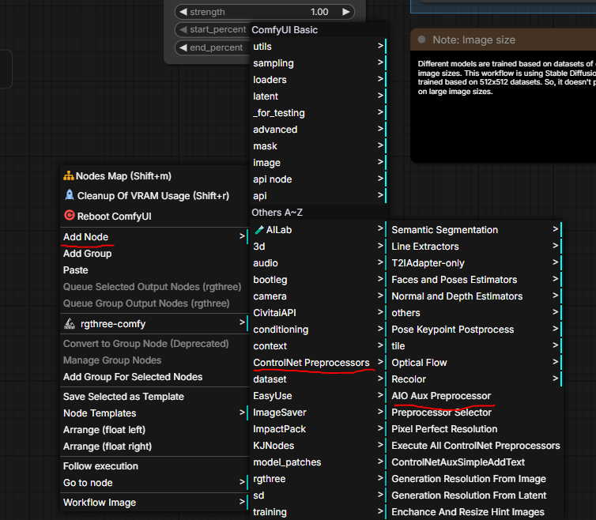
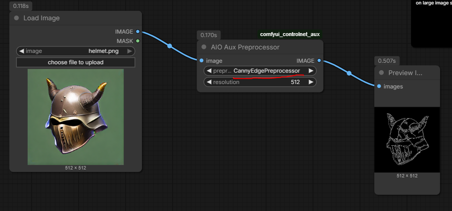
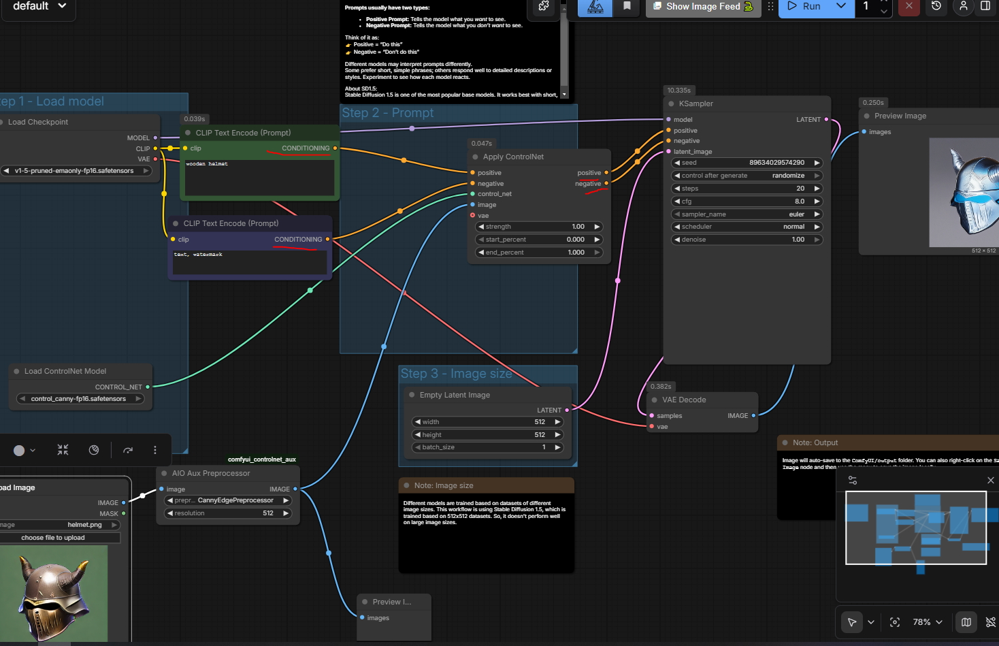
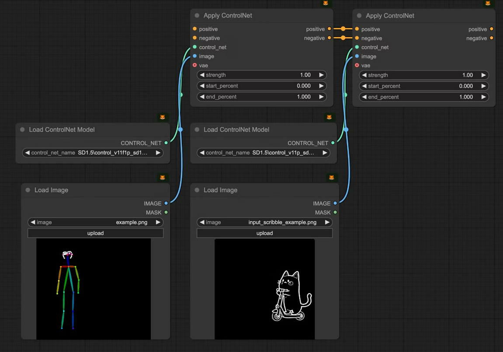

# ControlNet

AI image gen model that attempts to give you controls beyond text prompts. Example:

- Pose Control (OpenPose): Replicate specific human poses or create consistent character actions across images. ie. Skeleton2Img

- Structural Guidance (Canny, Sketch): Generate images from simple line art, sketches, or edge maps, maintaining the original layout. ie. Sketch2Img

- Depth & 3D Understanding (Depth, Normal Maps): Control the 3D layout and surface details of scenes, useful for interior design or game environments. Depth2Img, Normals2Img

- Image-to-Image Transformation: Transfer styles or details from an input image while maintaining its core structure, even with masks. Style Transfer.

- Animation & Video: Create consistent video sequences by applying control across frames (e.g., video-to-video reskinning).

- QR Codes: Generate artistic and stylized QR codes that are still scannable

ControlNet usually takes in your usual model + a controlnet model, 'dual-network' ML

We'll try to focus on sketch2img.

## Prerequisites

- click your `Custom Nodes Manager` button on the top RHS corner

- Search for `controlnet` and install `comfyui_controlnet_aux`

- Goto this [huggingface page](https://huggingface.co/webui/ControlNet-modules-safetensors/tree/main) and download `control_canny-fp16.safetensors` (plus any more you need). These are your ControlNet models.
Put these into your C:\Users\<user>\Documents\ComfyUI\models\controlnet folder

- Alternative models [here](https://huggingface.co/comfyanonymous/ControlNet-v1-1_fp16_safetensors/tree/main) with lineart softedge?

## Sketch2Img

- Click on `Templates` on the LHS, choose `Image Generation` template

- Click on `Models`, drag and drop the downloaded models in the controlnet folder. We'll use `control_canny-fp16.safetensors`

- Create a `Apply ControlNet` node. Best way to do this is via dragging the `CONTROL_NET` pin onto empty space, then choose `Apply ControlNet` to the menu that pops up

- We'll need to supply an image to the `Apply ControlNet` node. You can supply your own edge drawing, but for the example we'll generate one from `helmet.png`.

- To preprocess that image, right click `Add Node -> ControlNet Preprocessors -> AIO Aux Preprocessor` and create the node. AIO stands for 'All in one'.

- Change the `preprocess` option to `CannyEdgePreprocessor`. Then link a new `Preview Image` node and run it to see the results.

- Link the `IMAGE` output the to input of the `Apply ControlNet` node.

- Link the positive & negative prompts to `Apply ControlNet` node and link it's `positive/negative outputs` to `KSampler`

- Run 

## Further work

- Experiment. Stack controlnets together. Seems to need OpenPose for things to work. 

- Try chaining ControlNets together

### References

- https://docs.comfy.org/tutorials/controlnet/controlnet#1-controlnet-workflow-assets

